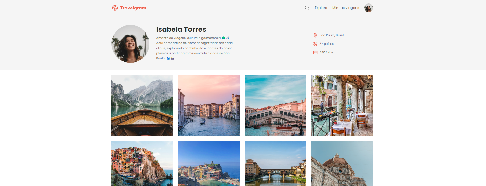

<h1 align="center">Travelgram - Perfil de Viagens</h1>

<a href="https://app.rocketseat.com.br/cart/rocketseat-one?referral=juan-almeida-1579997345&coupon=indicamgm&utm_source=platform&utm_medium=organic&utm_campaign=venda&utm_term=mgm&utm_content=indication-lp_one">Este projeto faz parte do curso Full Stack da Rocketseat, onde explorei os conceitos de Display Flex e variáveis CSS. Aprimore suas habilidades e embarque nessa jornada de aprendizado com a Rocketseat!</a>

  <a href="#-visão-geral-do-projeto">Visão Geral do Projeto</a>&nbsp;&nbsp;&nbsp;|&nbsp;&nbsp;&nbsp;
  <a href="#-tecnologias-utilizadas">Tecnologias Utilizadas</a>&nbsp;&nbsp;&nbsp;|&nbsp;&nbsp;&nbsp;
  <a href="#-estrutura-do-projeto">Estrutura do Projeto</a>&nbsp;&nbsp;&nbsp;|&nbsp;&nbsp;&nbsp;
  <a href="#-como-visualizar">Como Visualizar</a>&nbsp;&nbsp;&nbsp;

## 💻 Visão Geral do Projeto

Neste projeto, desenvolvi o layout de um perfil de rede social focado em viagens, chamado "Travelgram". A página apresenta um perfil fictício de uma usuária, exibindo suas fotos de viagem e informações como localização, número de países visitados e total de fotos postadas.

O objetivo principal deste projeto foi explorar os conceitos de **Display Flex** para criar um layout responsivo e de **variáveis CSS** para uma estilização eficiente e consistente.

## 🚀 Tecnologias Utilizadas

- **HTML**: Para a estruturação da página.
- **CSS**: Para a estilização e criação do layout com foco no uso de Display Flex e variáveis CSS.

## 🏗️ Estrutura do Projeto

O projeto é composto pelos seguintes arquivos:

- `index.html`: Contém a estrutura HTML da página.
- `styles/`: Pasta contendo os arquivos CSS divididos por componentes e seções:
  - `footer.css`
  - `global.css`
  - `header.css`
  - `index.css`
  - `main.css`
  - `nav.css`
- `assets/`: Contém as imagens e ícones utilizados na página.

## 👀 Como Visualizar

Para visualizar a página em seu navegador, siga estas etapas:

1. Faça o download ou clone este repositório.
2. Abra o arquivo `index.html` em um navegador web.

  
- Ou acesse o projeto finalizado, online: [Travelgram - Perfil de Viagens](https://juandasilvaa.github.io/Travelgram/)
